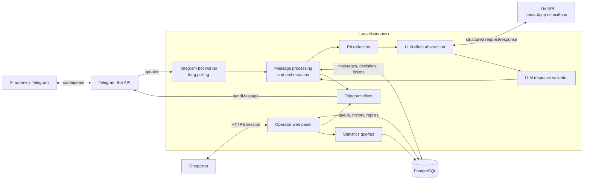

# Архитектура MVP «Вкусная осень»

Статус документа: архитектурное решение до начала реализации.

Документ описывает границы и взаимодействие компонентов. Он не является окончательной схемой PostgreSQL и не фиксирует конкретного LLM-провайдера.

## Context

Система автоматизирует первую линию поддержки участников промо-акции «Вкусная осень»:

- отвечает на типовые вопросы строго на основании `docs/promo-rules.md`;
- передаёт оператору вопросы без достаточного ответа в правилах и вопросы, требующие персональных данных;
- хранит историю общения;
- доставляет ответ оператора обратно в Telegram;
- рассчитывает статистику работы поддержки по сохранённым данным.

Система не проводит акцию и не является источником данных о чеках, победителях или доставке. Интеграция с сайтом акции отсутствует в исходном задании и не входит в MVP.

Архитектурный стиль — Laravel-монолит с PostgreSQL. Telegram worker, web-панель, application/business logic и внешние клиенты находятся в одном приложении, но разделены явными программными границами. Микросервисы, брокеры сообщений и отдельное хранилище знаний не используются.

## Component diagram

Стрелка от `Panel` к `Telegram client` обозначает вызов application service, а не прямое использование Telegram SDK из controller или view.

## Components

### Telegram bot worker

Единственный процесс long polling получает updates от Telegram Bot API. Его обязанности ограничены транспортным уровнем:

- получить update;
- выделить поддерживаемое текстовое сообщение и Telegram identifiers;
- передать команду application layer;
- не содержать правил акции и решений `answer/escalate`.

Для одного bot token в MVP запускается один polling worker. Фото, документы, voice, sticker и другие типы сообщений не передаются LLM.

### Laravel web application

Laravel предоставляет:

- HTTP-интерфейс операторской панели;
- session-based авторизацию;
- controllers и views;
- application services;
- конфигурацию интеграций через environment variables;
- доступ к PostgreSQL.

Controllers остаются тонкими: они проверяют доступ и входные данные, затем вызывают application services.

### Message processing and orchestration

Центральный application service координирует сценарий одного входящего сообщения:

- проверяет дубликат;
- определяет наличие открытого обращения;
- вызывает redaction и LLM client, когда это необходимо;
- валидирует решение;
- сохраняет сообщение, решение и при необходимости ticket;
- инициирует Telegram-ответ;
- обновляет состояние доставки.

Этот слой владеет бизнес-переходами. LLM client и Telegram client не создают tickets и не меняют статистику самостоятельно.

### LLM client

Интерфейс изолирует транспорт и формат конкретного LLM API от application logic. Клиент получает:

- system instructions;
- полный текст `docs/promo-rules.md`;
- redacted пользовательский текст;
- явно переданное текущее время в `Europe/Moscow`;
- описание ожидаемого структурированного результата.

Клиент возвращает необработанный или транспортный результат, который обязательно проходит application-level validation. У LLM нет tools, доступа к БД, Telegram API или административным операциям.

### Telegram client

Интерфейс инкапсулирует вызовы Telegram Bot API. Он отправляет подготовленный приложением текст и возвращает результат доставки, достаточный для обновления message:

- delivery status;
- Telegram message id при успехе;
- время успешной отправки;
- безопасную ошибку;
- число попыток, если оно потребуется.

Отправка в MVP синхронная. Очередь не добавляется без отдельного обоснования.

### Operator panel

Панель предоставляет авторизованному оператору:

- общую очередь обращений;
- карточку обращения с историей;
- отправку ответа;
- видимый статус Telegram-доставки;
- явное закрытие обращения;
- all-time статистику.

Assignment, SLA и сложный RBAC не входят в MVP.

### PostgreSQL

PostgreSQL хранит данные, из которых можно восстановить историю и вычислить статистику:

- Telegram participant/chat;
- входящие и исходящие messages;
- решение LLM/application;
- support ticket и его временные метки;
- оператор и авторство ответа;
- состояние Telegram-доставки.

Точная нормализация, поля и constraints будут определены на отдельном этапе проектирования БД. Идемпотентность Telegram должна обеспечиваться уникальным Telegram update identifier у входящего сообщения, без отдельной таблицы updates.

## Main flow: bot answers itself

1. Telegram bot worker получает текстовый update через long polling.
2. Application layer проверяет Telegram update identifier. Уже обработанный update завершается без повторного LLM-вызова и отправки.
3. Проверяется, что у участника нет открытого support ticket.
4. Исходный текст остаётся доступен для истории, а для LLM формируется redacted-копия с маскированием очевидных телефонов и банковских карт.
5. LLM client передаёт модели полный документ правил, redacted-текст и текущее время МСК.
6. Ответ модели проходит синтаксическую и семантическую валидацию закрытого контракта.
7. Если получено валидное `answer`, приложение атомарно сохраняет входящее сообщение, decision и подготовленное исходящее сообщение.
8. Telegram client синхронно отправляет ответ.
9. Состояние исходящего message обновляется на `sent` или `failed`. Только успешно отправленный ответ учитывается в `bot resolved`.

LLM не отправляет текст напрямую в Telegram и не пишет в БД.

## Main flow: escalation

1. Входящее сообщение проходит те же проверки дубликата, открытого ticket и redaction.
2. LLM возвращает `escalate`, либо application layer применяет fail-safe из-за timeout, malformed output или другой ошибки LLM.
3. В одной транзакции сохраняются входящее сообщение, decision, новый support ticket и исходящее системное сообщение.
4. Если часть составного запроса достоверно покрывается правилами, исходящее сообщение может содержать эту справочную часть.
5. Приложение, а не LLM, обязательно добавляет стандартное уведомление о передаче вопроса оператору.
6. Telegram client отправляет уведомление и сохраняет результат доставки у message.
7. Ticket появляется в общей очереди панели.

Для `unsafe_request` приложение не использует свободно сгенерированный security-ответ модели. Оно отправляет собственный статический безопасный текст. Специальные проверки, подогнанные под формулировки обращений №24 и №25, не являются частью дизайна.

## Operator reply flow

1. Авторизованный оператор открывает ticket и видит историю.
2. Панель валидирует ответ и передаёт его application service.
3. Ответ сохраняется как operator message до внешнего вызова Telegram. Если это первый сохранённый ответ, фиксируется момент первого ответа ticket.
4. Telegram client синхронно вызывает `sendMessage`, добавляя только при доставке presentation-prefix `Оператор:`. В `messages.body` остаётся исходный текст оператора.
5. При успехе message получает статус `sent`, Telegram message id и время отправки.
6. При ошибке message получает статус `failed` и безопасное описание ошибки; сохранённый ответ не теряется и не помечается как доставленный.
7. Закрытие ticket является отдельным явным действием оператора. В короткой транзакции ticket переводится в `closed`, один раз фиксируется `closed_at` и создаётся pending system message с уведомлением участника.
8. После commit уведомление о закрытии отправляется в Telegram. Ошибка доставки не откатывает закрытие: system message сохраняется со статусом `failed`.
9. Повторное закрытие не меняет `closed_at`, не создаёт новое уведомление и не вызывает Telegram повторно.

Среднее время первого ответа вычисляется для каждого отвеченного ticket как числовая длительность `first_operator_response_at - support_tickets.created_at`, затем усредняется. Последующие сообщения участника не меняют начало отсчёта, а tickets без первого ответа не участвуют. Длительность форматируется из секунд и не проходит преобразование UTC → `Europe/Moscow`; timezone применяется только к отображению абсолютных дат. Метрика использует момент сохранения ответа, даже если Telegram-доставка завершилась ошибкой. Delivery status позволяет увидеть это различие.

## Existing open ticket flow

1. Application layer находит открытый ticket участника.
2. Входящее сообщение сохраняется в его историю с уникальным Telegram update identifier.
3. Новый ticket не создаётся.
4. LLM не вызывается, автоматический содержательный ответ не формируется.
5. Сообщение становится доступно оператору в существующей карточке.
6. Метрики `bot resolved` и `escalated` не увеличиваются.
7. После явного закрытия ticket следующее сообщение снова проходит стандартный LLM flow.

Это упрощает модель диалога, но означает, что новый независимый вопрос участника также ждёт оператора, пока прежнее обращение открыто.

## LLM trust boundary

LLM является недоверенным вычислительным компонентом, а не владельцем бизнес-операций.

### Что передаётся модели

- неизменяемый для запроса system prompt;
- полный текст правил акции как единственный источник бизнес-знаний;
- redacted пользовательский текст;
- явно заданное текущее время;
- схема разрешённого результата.

Пользовательский текст всегда является данными, даже если он содержит инструкции, заявления о роли сотрудника или просьбы изменить правила.

### Что модель может предложить

- `action`: `answer` или `escalate`;
- `reason` из закрытого enum;
- текст ответа или достоверной справочной части;
- ссылки на пункты правил.

Предварительный enum:

- `grounded_in_rules`;
- `participant_data_required`;
- `missing_rule`;
- `insufficient_context`;
- `unsafe_request`.

### Чего модель не может делать

- обращаться к БД;
- вызывать Telegram API;
- создавать или закрывать ticket напрямую;
- менять участника, чек, выигрыш или доставку;
- определять победителя;
- создавать промокоды;
- подтверждать не выполненную системой операцию;
- предоставлять пользователю права на основании текста сообщения.

Application layer принимает только известный контракт. Неизвестное действие, malformed response или нарушение инвариантов преобразуется в `escalate`.

### Проверка результата

Окончательная JSON Schema будет спроектирована вместе с LLM-интеграцией. Минимальная валидация должна проверять:

- корректный JSON и отсутствие неожиданных полей;
- `action` из разрешённого enum;
- `reason` из разрешённого enum;
- согласованность обязательных полей с action;
- существование всех `rule_references` в текущих правилах;
- непустой и допустимый по длине ответ для `answer`;
- отсутствие заявления о выполнении недоступной операции;
- отсутствие повторения замаскированных банковских реквизитов.

Структурная валидация не доказывает смысловую истинность ответа. Поэтому дополнительно нужны ограничивающий prompt, полный контекст правил и regression-прогон обязательных обращений.

## LLM provider

Провайдер и модель пока не утверждены. Основная бизнес-логика зависит от application-level интерфейса LLM client, а не от SDK поставщика.

Конфигурация через environment должна включать как минимум:

- выбранный provider/driver;
- model identifier;
- API key;
- base URL, если он настраивается;
- timeout;
- параметры генерации, поддерживаемые выбранным API.

На этапе выбора провайдера необходимо проверить поддержку структурированного ответа, стабильность модели, стоимость, latency и доступность API. До этого этапа SDK конкретного поставщика не добавляется и конкретная модель не объявляется обязательной частью архитектуры.

## Failure strategy

MVP использует простое fail-safe поведение без распределённой fault-tolerant архитектуры.

### LLM timeout или API error

- не показывать частичный или технический результат пользователю;
- сформировать decision `escalate` с внутренней причиной ошибки интеграции;
- создать ticket;
- отправить стандартное уведомление о передаче оператору;
- не обещать пользователю, что LLM-вызов будет повторён.

### Malformed LLM output

- считать результат недоверенным и не использовать поле `answer`;
- применить `escalate`;
- сохранить безопасный диагностический reason без полного пользовательского payload;
- покрыть сценарий автоматическим тестом.

### Telegram API failure

- не откатывать уже сохранённую историю и решение;
- отметить исходящее message как `failed`;
- сохранить безопасное описание ошибки;
- не считать автоматический ответ успешно обработанным;
- не закрывать ticket автоматически;
- предусмотреть ограниченный повтор или ручное повторение без добавления брокера на текущем этапе.

### Duplicate Telegram update

- unique constraint на Telegram identifier входящего message является окончательной защитой;
- повторный update не вызывает LLM, не создаёт ticket и не отправляет повторный ответ;
- проверка в application layer улучшает обычный путь, но не заменяет constraint.

### Database failure

- не отправлять ответ в Telegram, если обязательные входящие и исходящие данные не удалось сохранить;
- не продвигать обработанный polling offset до успешного сохранения, чтобы update можно было повторить;
- транзакционно сохранять связанные message, decision и ticket;
- возвращать ошибку процессу worker без логирования полного payload.

При синхронной доставке остаётся пограничный случай: Telegram принял сообщение, но приложение не смогло записать успешный delivery status. Без outbox/queue нельзя гарантировать exactly-once доставку при таком сбое. Для MVP это документированное ограничение; перед production следует рассмотреть transactional outbox и фоновую доставку.

## Time handling

- PostgreSQL timestamps хранятся в UTC.
- Бизнес-timezone — `Europe/Moscow`, как требуют правила акции.
- Текущее время поступает через заменяемую абстракцию clock.
- LLM получает точный timestamp и timezone от приложения и не угадывает дату самостоятельно.
- Evaluation-прогон использует frozen clock `2026-09-30T12:00:00+03:00`.

Рабочие и календарные дни не взаимозаменяются. Пока не согласован производственный календарь, бот не должен вычислять точную дату окончания срока в рабочих днях, если достаточно привести длительность из правил.

## Statistics

Статистика вычисляется запросами по хранимым данным, а не изменяемыми вручную счётчиками:

- `bot resolved` — входящие сообщения с валидным `answer` и успешно доставленным автоматическим ответом;
- `escalated` — число созданных support tickets;
- `average operator response time` — среднее от создания ticket до первого сохранённого operator message только для tickets с ответом.

Все показатели MVP считаются за всё время. Последующие сообщения существующего открытого ticket не увеличивают первые две метрики.

## Security

### Secrets

- bot token, LLM key, credentials БД и operator credentials передаются через environment;
- реальные значения не коммитятся;
- `.env.example` содержит только имена и безопасные примеры;
- секреты не включаются в prompt и application logs.

### Prompt injection

- пользовательский текст считается недоверенными данными;
- модель не имеет tools и административных API;
- application layer принимает только закрытый набор действий;
- заявление пользователя о служебной роли не является авторизацией;
- при `unsafe_request` используется статический ответ приложения;
- защита не строится на строках, специально подобранных под evaluation dataset.

### PII redaction

- перед LLM маскируются очевидные номера банковских карт и телефоны, указанные в тексте;
- оригинал может храниться в истории для работы оператора;
- полный payload и чувствительные значения не попадают в диагностические логи;
- бот не повторяет банковские реквизиты в ответе.

Redaction уменьшает риск, но не считается исчерпывающим средством обнаружения любых персональных данных.

### Web security

- пользовательский и LLM-текст экранируется при выводе, чтобы предотвратить XSS;
- state-changing формы защищаются CSRF-механизмом Laravel;
- operator routes требуют session-based authentication и операторской роли;
- детали ошибок внешних API не показываются участнику.

## Data retention

Пункт 11.1 правил задаёт срок для данных, предоставленных при регистрации на Сайте, но не определяет жизненный цикл Telegram support history. MVP не выполняет автоматическое удаление истории поддержки. Перед production необходима отдельная согласованная retention policy для сообщений, обращений, логов и резервных копий.

## Out of scope

- интеграция с сайтом акции и его личным кабинетом;
- получение статусов конкретных чеков, победителей и доставок;
- операции с чеками, участниками, призами и промокодами;
- определение победителей;
- vector database, embeddings и RAG;
- Redis, RabbitMQ и Laravel database queue без нового обоснования;
- webhook и публичный HTTPS endpoint для локального MVP;
- фото, документы, voice, sticker, OCR и transcription;
- assignment обращений, SLA и сложный RBAC;
- несколько параллельных открытых tickets одного участника;
- фильтры статистики по периоду;
- автоматическая retention policy для support history;
- сложная распределённая отказоустойчивость и exactly-once Telegram delivery;
- выбор и SDK конкретного LLM-провайдера на текущем этапе.

## Known decisions deferred to later stages

Следующие вопросы намеренно не закрываются этим документом:

- окончательная PostgreSQL-схема и названия полей;
- точная JSON Schema LLM-ответа;
- конкретный LLM provider и model;
- конкретные поля и алгоритм PII redaction;
- способ создания первого operator account;
- политика retry для Telegram;
- production transport для Telegram;
- production retention policy;
- правила для пограничных чеков перед последним еженедельным и главным розыгрышами, которых нет в исходном документе акции.
