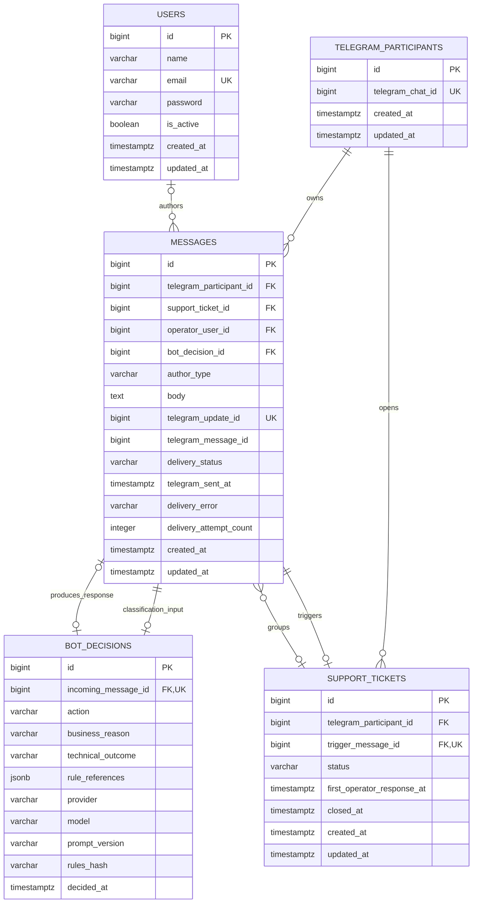

# Модель данных PostgreSQL для MVP «Вкусная осень»

Статус документа: проектирование до создания Laravel migrations и Eloquent models.

Модель намеренно ограничена пятью предметными таблицами:

1. `telegram_participants`;
2. `messages`;
3. `bot_decisions`;
4. `support_tickets`;
5. `users`.

Framework-таблицы Laravel не являются частью этого документа. Отдельные таблицы для Telegram updates, попыток доставки, статистики, правил, prompt-версий, ролей и истории статусов не требуются для согласованного MVP.

## Goals

Схема должна обеспечивать:

- минимальную идентификацию Telegram participant/chat;
- единую хронологию сообщений участника, бота, приложения и оператора;
- идемпотентную обработку Telegram updates;
- сохранение структурированного решения бота без смешивания бизнес-классификации и технического результата LLM-вызова;
- очередь support tickets и максимум одно открытое обращение участника;
- авторство ответа оператора;
- состояние синхронной Telegram-доставки;
- вычисление трёх требуемых метрик по фактическим данным;
- сохранение истории при деактивации оператора и запрет случайного каскадного удаления.

Модель не представляет участника Telegram подтверждённым участником сайта акции и не хранит данные профиля Telegram, которые не нужны для поддержки.

## ER diagram

Диаграмма показывает предметные сущности и основные связи. Она намеренно не отображает индексы и все `CHECK` constraints.



`MESSAGES.bot_decision_id` связывает решение с одним итоговым автоматическим сообщением пользователю. Входящее сообщение связано с тем же решением обратной связью `BOT_DECISIONS.incoming_message_id`.

Сообщение, непосредственно вызвавшее эскалацию, связано с ticket через `SUPPORT_TICKETS.trigger_message_id`. Его `MESSAGES.support_ticket_id` оставляется `NULL`, поэтому вставка не требует циклического обновления. Все последующие сообщения диалога и исходящее уведомление об эскалации получают `support_ticket_id`. История ticket выбирается как trigger message плюс сообщения с соответствующим `support_ticket_id`.

## Tables

### `telegram_participants`

Назначение: локальный идентификатор Telegram private chat, необходимый для поиска истории и отправки ответа.

| Колонка | PostgreSQL type | Null | Default | Constraints | Назначение |
|---|---|---:|---|---|---|
| `id` | `BIGINT GENERATED BY DEFAULT AS IDENTITY` | нет | identity | `PRIMARY KEY` | Внутренний стабильный идентификатор. |
| `telegram_chat_id` | `BIGINT` | нет | — | `UNIQUE` | Идентификатор чата для поиска participant и вызова Telegram `sendMessage`. |
| `created_at` | `TIMESTAMP WITH TIME ZONE` | нет | `CURRENT_TIMESTAMP` | — | Момент первого появления participant в системе. |
| `updated_at` | `TIMESTAMP WITH TIME ZONE` | нет | `CURRENT_TIMESTAMP` | — | Техническая временная метка изменения строки. |

Для private-chat MVP одного `telegram_chat_id` достаточно и для поиска участника, и для отправки ответа. Отдельный `telegram_user_id`, username, имя, фамилия, язык и номер телефона не сохраняются: они не нужны обязательным сценариям и создали бы дополнительные персональные данные.

`telegram_chat_id` не доказывает, что отправитель зарегистрирован на сайте акции, и не связывается автоматически с телефонным номером участника акции.

Если перед production появится поддержка групп, нескольких Telegram-ботов или перенос диалога между чатами, идентификацию потребуется пересмотреть.

### `messages`

Назначение: единая неизменяемая по смыслу история коммуникации. В таблице находятся входящие сообщения участника, автоматические ответы, системные уведомления и ответы операторов.

| Колонка | PostgreSQL type | Null | Default | Constraints | Назначение |
|---|---|---:|---|---|---|
| `id` | `BIGINT GENERATED BY DEFAULT AS IDENTITY` | нет | identity | `PRIMARY KEY` | Внутренний идентификатор сообщения. |
| `telegram_participant_id` | `BIGINT` | нет | — | `FOREIGN KEY` → `telegram_participants.id` | Владелец Telegram-диалога. |
| `support_ticket_id` | `BIGINT` | да | `NULL` | `FOREIGN KEY` → `support_tickets.id` | Обращение, в историю которого входит сообщение; не используется на trigger message. |
| `operator_user_id` | `BIGINT` | да | `NULL` | `FOREIGN KEY` → `users.id` | Автор для `author_type = 'operator'`. |
| `bot_decision_id` | `BIGINT` | да | `NULL` | `FOREIGN KEY` → `bot_decisions.id`, `UNIQUE` | Решение, из которого сформировано итоговое автоматическое сообщение. |
| `author_type` | `VARCHAR(16)` | нет | — | `CHECK` | `participant`, `bot`, `system` или `operator`. |
| `body` | `TEXT` | нет | — | непустой после `trim` | Оригинальный пользовательский текст либо фактически подготовленный исходящий текст. |
| `telegram_update_id` | `BIGINT` | да | `NULL` | `UNIQUE` | Глобальный для одного бота update identifier; присутствует только у входящего сообщения. |
| `telegram_message_id` | `BIGINT` | да | `NULL` | — | Telegram message identifier: обязателен для входящего и успешно отправленного исходящего сообщения. |
| `delivery_status` | `VARCHAR(20)` | нет | — | `CHECK` | `not_applicable`, `pending`, `sent` или `failed`. |
| `telegram_sent_at` | `TIMESTAMP WITH TIME ZONE` | да | `NULL` | `CHECK` совместно со статусом | Момент, когда Telegram API подтвердил отправку исходящего сообщения. Это не read receipt. |
| `delivery_error` | `VARCHAR(500)` | да | `NULL` | `CHECK` совместно со статусом | Безопасное описание последней ошибки без токенов и полного payload. |
| `delivery_attempt_count` | `INTEGER` | нет | `0` | `CHECK >= 0` | Число выполненных попыток отправки исходящего сообщения. |
| `created_at` | `TIMESTAMP WITH TIME ZONE` | нет | `CURRENT_TIMESTAMP` | — | Момент сохранения сообщения. Используется для порядка истории. |
| `updated_at` | `TIMESTAMP WITH TIME ZONE` | нет | `CURRENT_TIMESTAMP` | — | Момент последнего изменения delivery state. |

#### Author invariants

- `participant`: `telegram_update_id` и `telegram_message_id` обязательны; `operator_user_id` и `bot_decision_id` равны `NULL`.
- `operator`: `operator_user_id` и `support_ticket_id` обязательны; `telegram_update_id` и `bot_decision_id` равны `NULL`.
- `bot` и `system`: `operator_user_id` и `telegram_update_id` равны `NULL`; `bot_decision_id` может быть задан для ответа на классифицированное сообщение.
- `bot_decision_id` разрешён только для `bot` или `system`.

`bot_decision_id` уникален, поэтому одно решение создаёт не более одного итогового автоматического сообщения. Частичная справка и стандартное уведомление об эскалации объединяются в один Telegram message. Это сознательное упрощение MVP; разбиение длинного ответа на несколько сообщений потребует пересмотра этой связи.

#### Delivery invariants

- Для входящего `participant`-сообщения используется `delivery_status = 'not_applicable'`. Это явно означает, что исходящая доставка неприменима, а не «ещё не выполнена».
- При `not_applicable`: `telegram_sent_at` и `delivery_error` равны `NULL`, `delivery_attempt_count = 0`.
- При `pending`: исходящий вызов ещё не подтверждён; `telegram_sent_at` и `delivery_error` равны `NULL`.
- При `sent`: `telegram_message_id` и `telegram_sent_at` обязательны, `delivery_error` равен `NULL`, число попыток не меньше 1.
- При `failed`: `telegram_sent_at` равен `NULL`, безопасный `delivery_error` обязателен, число попыток не меньше 1.
- `participant` может иметь только `not_applicable`; `bot`, `system` и `operator` — только `pending`, `sent` или `failed`.

При повторной синхронной попытке приложение увеличивает `delivery_attempt_count` и обновляет поля той же строки. Отдельная история каждой попытки в MVP не хранится.

### `bot_decisions`

Назначение: одно проверяемое решение для каждого нового входящего сообщения, которое прошло классификацию. Сообщения, добавленные к уже открытому ticket без LLM-вызова, строки `bot_decisions` не получают.

| Колонка | PostgreSQL type | Null | Default | Constraints | Назначение |
|---|---|---:|---|---|---|
| `id` | `BIGINT GENERATED BY DEFAULT AS IDENTITY` | нет | identity | `PRIMARY KEY` | Идентификатор решения. |
| `incoming_message_id` | `BIGINT` | нет | — | `FOREIGN KEY` → `messages.id`, `UNIQUE` | Единственное входящее сообщение, которое классифицировалось. |
| `action` | `VARCHAR(16)` | нет | — | `CHECK IN ('answer', 'escalate')` | Итоговое действие приложения. |
| `business_reason` | `VARCHAR(40)` | да | `NULL` | `CHECK` | Бизнес-классификация только для валидного результата LLM. |
| `technical_outcome` | `VARCHAR(40)` | нет | — | `CHECK` | Технический исход обработки LLM. |
| `rule_references` | `JSONB` | нет | `'[]'::jsonb` | `CHECK jsonb_typeof(...) = 'array'` | Список идентификаторов пунктов правил. |
| `provider` | `VARCHAR(80)` | да | `NULL` | — | Фактически выбранный provider, если вызов был сконфигурирован. |
| `model` | `VARCHAR(120)` | да | `NULL` | — | Фактический model identifier, если он известен. |
| `prompt_version` | `VARCHAR(64)` | нет | — | — | Версия application prompt. |
| `rules_hash` | `VARCHAR(64)` | нет | — | `CHECK` на длину 64 и hex-символы | SHA-256 содержимого правил, переданного модели. |
| `decided_at` | `TIMESTAMP WITH TIME ZONE` | нет | `CURRENT_TIMESTAMP` | — | Момент принятия итогового решения. |

Допустимые `business_reason`:

- `grounded_in_rules`;
- `participant_data_required`;
- `missing_rule`;
- `insufficient_context`;
- `unsafe_request`.

Допустимые `technical_outcome`:

- `valid` — ответ LLM прошёл parsing и application validation;
- `malformed_response` — ответ не разобран или не соответствует schema;
- `timeout` — LLM не ответила в установленный срок;
- `api_failure` — HTTP/provider/rate-limit ошибка;
- `application_failure` — приложение применило fail-safe до получения пригодного решения по другой технической причине.

#### Separation of concerns

`business_reason` и `technical_outcome` отвечают на разные вопросы:

- бизнес-причина объясняет, почему содержательно выбран `answer` или `escalate`;
- технический исход объясняет, был ли вообще получен пригодный результат LLM.

Для `technical_outcome = 'valid'` поле `business_reason` обязательно.

Для любого невалидного технического исхода:

- `business_reason IS NULL`, потому что LLM не приняла доверенное бизнес-решение;
- `action = 'escalate'`;
- `rule_references = '[]'::jsonb`;
- fail-safe считается использованным.

Таким образом, отдельные boolean-поля `llm_response_valid` и `fail_safe_used` не хранятся:

- `llm_response_valid = (technical_outcome = 'valid')`;
- `fail_safe_used = (technical_outcome <> 'valid')`.

Это устраняет противоречивые комбинации вроде `llm_response_valid = true` одновременно с `fail_safe_used = true`.

#### Why answer text is not duplicated

Подготовленный пользователю ответ не хранится в `bot_decisions`. Фактически отправляемая версия находится в `messages.body` строки, связанной через `messages.bot_decision_id`.

Это решение:

- не создаёт вторую копию потенциальных персональных данных;
- не создаёт расхождение между «ответом решения» и реально отправленным текстом;
- сохраняет достаточно данных для аудита и evaluation: action, причины, ссылки на правила, версии prompt/rules и итоговый message.

Raw LLM response также не сохраняется в предметной БД MVP. При необходимости диагностики перед production потребуется отдельная политика безопасного хранения и redaction.

### `support_tickets`

Назначение: единица работы общей очереди операторов.

| Колонка | PostgreSQL type | Null | Default | Constraints | Назначение |
|---|---|---:|---|---|---|
| `id` | `BIGINT GENERATED BY DEFAULT AS IDENTITY` | нет | identity | `PRIMARY KEY` | Идентификатор обращения. |
| `telegram_participant_id` | `BIGINT` | нет | — | `FOREIGN KEY` → `telegram_participants.id` | Владелец обращения и ключ ограничения одного открытого ticket. |
| `trigger_message_id` | `BIGINT` | нет | — | `FOREIGN KEY` → `messages.id`, `UNIQUE` | Входящее сообщение, которое вызвало эскалацию. |
| `status` | `VARCHAR(16)` | нет | `'open'` | `CHECK IN ('open', 'closed')` | Состояние обращения. |
| `first_operator_response_at` | `TIMESTAMP WITH TIME ZONE` | да | `NULL` | временной `CHECK` | Момент сохранения первого ответа оператора. |
| `closed_at` | `TIMESTAMP WITH TIME ZONE` | да | `NULL` | согласован со `status` | Момент явного закрытия. |
| `created_at` | `TIMESTAMP WITH TIME ZONE` | нет | `CURRENT_TIMESTAMP` | — | Начало ожидания оператора. |
| `updated_at` | `TIMESTAMP WITH TIME ZONE` | нет | `CURRENT_TIMESTAMP` | — | Последнее изменение ticket. |

Причина эскалации не дублируется отдельной строкой в ticket. Она восстанавливается через `trigger_message_id` → уникальный `bot_decisions.incoming_message_id`:

- для валидного LLM-решения используется `business_reason`;
- для fail-safe используется `technical_outcome`.

Application service обязан создавать ticket только для trigger message, у которого в той же транзакции сохранён `bot_decisions.action = 'escalate'`. Стандартный `FOREIGN KEY` не может проверить значение `action` в другой таблице; это проверяется service-level invariant и feature test. Уникальный `bot_decisions.incoming_message_id` исключает несколько решений для одного trigger.

Временные constraints:

- `first_operator_response_at IS NULL OR first_operator_response_at >= created_at`;
- `status = 'open'` требует `closed_at IS NULL`;
- `status = 'closed'` требует `closed_at IS NOT NULL AND closed_at >= created_at`.

Первый ответ и operator message записываются в одной транзакции: приложение устанавливает `first_operator_response_at` только через условное обновление `WHERE first_operator_response_at IS NULL`. Это защищает значение от перезаписи последующими ответами.

Максимум один открытый ticket участника обеспечивается partial unique index:

```sql
CREATE UNIQUE INDEX support_tickets_one_open_per_participant_uq
    ON support_tickets (telegram_participant_id)
    WHERE status = 'open';
```

Такой индекс подходит лучше обычного `UNIQUE (telegram_participant_id, status)`: обычное ограничение ошибочно разрешило бы только один закрытый ticket на участника, а история должна содержать любое число закрытых обращений.

### `users`

Назначение: session-authenticated пользователи операторской панели и авторство операторских сообщений.

| Колонка | PostgreSQL type | Null | Default | Constraints | Назначение |
|---|---|---:|---|---|---|
| `id` | `BIGINT GENERATED BY DEFAULT AS IDENTITY` | нет | identity | `PRIMARY KEY` | Идентификатор оператора. |
| `name` | `VARCHAR(120)` | нет | — | — | Отображаемое имя в панели и истории. |
| `email` | `VARCHAR(255)` | нет | — | `UNIQUE` | Login identifier. Нормализация регистра выполняется приложением до сохранения. |
| `password` | `VARCHAR(255)` | нет | — | — | Хеш пароля, никогда не plaintext. |
| `is_active` | `BOOLEAN` | нет | `TRUE` | — | Возможность входа в панель. |
| `created_at` | `TIMESTAMP WITH TIME ZONE` | нет | `CURRENT_TIMESTAMP` | — | Момент создания аккаунта. |
| `updated_at` | `TIMESTAMP WITH TIME ZONE` | нет | `CURRENT_TIMESTAMP` | — | Момент изменения аккаунта. |

Колонка `role` не нужна: все пользователи этой MVP-панели являются операторами. `is_active` является корректным boolean, потому что описывает ровно два состояния допуска к входу, а не многошаговый бизнес-процесс.

Операторские аккаунты деактивируются, а не удаляются. Это сохраняет автора исторических сообщений без snapshot-копии имени и без `SET NULL`.

## Relationships

### Participant → messages

- Cardinality: `telegram_participants 1 → 0..N messages`.
- Ownership: каждое message принадлежит ровно одному participant.
- FK: `messages.telegram_participant_id NOT NULL`.
- Один participant определяется одним уникальным `telegram_chat_id`.

### Participant → support tickets

- Cardinality: `telegram_participants 1 → 0..N support_tickets` за всё время.
- FK: `support_tickets.telegram_participant_id NOT NULL`.
- Partial unique index ограничивает активную часть связи до `0..1` open ticket.

### Incoming message → bot decision

- Cardinality: классифицируемое входящее message `1 → 1 bot_decision`; любое message в общем случае `1 → 0..1 bot_decision`.
- FK находится в `bot_decisions.incoming_message_id NOT NULL`.
- `UNIQUE (incoming_message_id)` запрещает несколько решений для одного сообщения.
- Последующее сообщение уже открытого ticket не классифицируется и не имеет decision.

### Bot decision → automatic response message

- Cardinality: `bot_decision 1 → 0..1 messages` на уровне сохранённого состояния; штатный завершённый flow создаёт одно сообщение.
- Nullable FK находится в `messages.bot_decision_id`.
- `UNIQUE (bot_decision_id)` запрещает несколько итоговых автоматических сообщений для одного решения.
- Nullable нужен, потому что participant/operator messages и некоторые системные сообщения не производятся LLM-решением.

### Ticket → messages

- Trigger связан через `support_tickets.trigger_message_id NOT NULL UNIQUE`.
- Последующие participant messages, системное уведомление и operator replies используют `messages.support_ticket_id`.
- `messages.support_ticket_id` nullable, потому что самостоятельно обработанный вопрос и его ответ ticket не имеют.
- История выбирается по условию `messages.id = trigger_message_id OR messages.support_ticket_id = ticket.id` и сортируется по `created_at, id`.

### Operator → operator messages

- Cardinality: `users 1 → 0..N messages`.
- `messages.operator_user_id` nullable для всех неоператорских сообщений.
- Для `author_type = 'operator'` поле обязательно и сопровождается `support_ticket_id`.

### Trigger message → support ticket

- Cardinality: входящее message `1 → 0..1 support_ticket`.
- `support_tickets.trigger_message_id NOT NULL UNIQUE` гарантирует, что одно сообщение не создаст два tickets.
- Trigger должен принадлежать тому же participant, что и ticket. Проверка выполняется application service внутри транзакции; добавление ради этого двух избыточных composite unique indexes признано чрезмерным для MVP.

### Insert order and cycles

Штатный порядок не требует временно нарушать `NOT NULL` или обновлять ранее вставленные строки:

1. входящее message без `support_ticket_id`;
2. bot decision, ссылающийся на входящее message;
3. при эскалации ticket, ссылающийся на trigger message;
4. автоматическое исходящее message, ссылающееся на decision и при эскалации на ticket.

Хотя граф внешних ключей содержит двусторонние смысловые связи, каждая новая строка может быть вставлена в этом порядке без deferred constraints.

## Foreign key delete/update behaviour

История поддержки является значимой частью MVP, поэтому `CASCADE` для предметных данных не используется.

| Foreign key | `ON DELETE` | `ON UPDATE` | Обоснование |
|---|---|---|---|
| `messages.telegram_participant_id` | `RESTRICT` | `RESTRICT` | Нельзя удалить participant и неявно уничтожить переписку. |
| `messages.support_ticket_id` | `RESTRICT` | `RESTRICT` | Ticket с историей не удаляется; закрытие меняет status. |
| `messages.operator_user_id` | `RESTRICT` | `RESTRICT` | Авторство сохраняется; оператор деактивируется через `is_active`. |
| `messages.bot_decision_id` | `RESTRICT` | `RESTRICT` | Нельзя удалить decision, на основании которого сформирован ответ. |
| `bot_decisions.incoming_message_id` | `RESTRICT` | `RESTRICT` | Нельзя оставить decision без исходного вопроса. |
| `support_tickets.telegram_participant_id` | `RESTRICT` | `RESTRICT` | Нельзя отделить ticket от владельца. |
| `support_tickets.trigger_message_id` | `RESTRICT` | `RESTRICT` | Нельзя удалить сообщение, объясняющее происхождение обращения. |

Первичные ключи считаются неизменяемыми. Production-удаление или анонимизация после утверждения retention policy должны быть отдельным осознанным процессом, а не побочным эффектом удаления parent row.

## PostgreSQL types and state representation

### Identifiers

- Внутренние PK: `BIGINT ... AS IDENTITY`. Семантически это современная PostgreSQL-альтернатива `BIGSERIAL`: sequence связан с identity-колонкой явнее, а явная вставка управляется режимом identity.
- В Laravel конкретная migration-команда может создать `BIGSERIAL`-совместимую колонку. Для MVP оба варианта достаточны по диапазону; важен внешний контракт `BIGINT`, а не различие механизма генерации.
- Telegram chat, update и message identifiers хранятся как signed `BIGINT`: диапазон `INTEGER` недостаточен, а chat id может быть отрицательным в других типах чатов.

### Text

- `TEXT` используется для `messages.body`, потому что бизнес-смысл не требует искусственного ограничения длины на уровне БД. Ограничение Telegram проверяется при формировании исходящего сообщения.
- `VARCHAR(n)` используется для коротких кодов состояний, идентификаторов модели и bounded error description.
- `VARCHAR(64)` с проверкой точной длины используется для hex SHA-256 правил; это избегает padding-семантики `CHAR` и прямо отображается стандартным Laravel string type.

### Time

Все моменты хранятся как `TIMESTAMP WITH TIME ZONE` (`timestamptz`). PostgreSQL нормализует такие значения по времени; приложение показывает их в `Europe/Moscow`. Evaluation clock влияет на application logic, а не меняет типы БД.

`DEFAULT CURRENT_TIMESTAMP` задаёт значение при `INSERT`, но не обновляет `updated_at` автоматически. Application layer должна явно менять `updated_at` вместе с изменяемым состоянием.

### JSONB

`JSONB` используется только для небольшого массива `rule_references`. Отдельная таблица `rules` отсутствует, а количество ссылок переменно. Application validation проверяет, что элементы массива являются строковыми идентификаторами существующих пунктов.

Остальные поля не помещаются в универсальный JSONB: отдельные типизированные колонки лучше поддерживают constraints, joins и статистику.

### Integer and boolean

- `INTEGER` используется для `delivery_attempt_count` с `CHECK >= 0`.
- `BOOLEAN` используется только для `users.is_active`, где действительно есть два состояния.
- Action, status, author и delivery state не представлены boolean, потому что имеют больше двух значений или могут расширяться.

### `VARCHAR + CHECK` instead of PostgreSQL ENUM

Для MVP выбран `VARCHAR + CHECK constraint`.

Преимущества:

- состояние видно и проверяется на уровне БД;
- изменение списка значений оформляется обычным изменением constraint;
- Laravel migrations проще откатывать и переносить;
- не требуется управлять отдельным PostgreSQL enum type и порядком его изменения.

PostgreSQL ENUM даёт строгий тип, но для небольшого Laravel MVP усложняет эволюцию и rollback без заметного выигрыша.

## Constraints and invariants

Ключевые database-level инварианты:

1. `telegram_participants.telegram_chat_id` уникален.
2. `messages.telegram_update_id` уникален; `NULL` разрешён для любого числа исходящих сообщений.
3. Один incoming message имеет максимум один `bot_decision` благодаря `UNIQUE (incoming_message_id)`.
4. Одно решение имеет максимум одно итоговое автоматическое сообщение благодаря nullable `UNIQUE (messages.bot_decision_id)`.
5. Одно trigger message создаёт максимум один ticket благодаря `UNIQUE (trigger_message_id)`.
6. Один participant имеет максимум один ticket со `status = 'open'` благодаря partial unique index.
7. `status` и `closed_at` ticket всегда согласованы.
8. Невалидный технический исход всегда приводит к `action = 'escalate'`, `business_reason IS NULL` и пустым `rule_references`.
9. Валидный технический исход требует непустой допустимый `business_reason`.
10. Author-specific `CHECK` constraints не позволяют participant message получить operator id или исходящее delivery state.
11. Delivery-specific `CHECK` constraints не позволяют `sent` без Telegram message id/time или `failed` без безопасной ошибки.
12. `first_operator_response_at` и `closed_at` не могут быть раньше `support_tickets.created_at`.

Инварианты, которые требуют application transaction и тестов, потому что обычный row-level `CHECK` не читает другие таблицы:

- participant ticket совпадает с participant trigger message;
- ticket создаётся только для decision с `action = 'escalate'`;
- `first_operator_response_at` соответствует первому сохранённому operator message;
- сообщение с `support_ticket_id` принадлежит participant этого ticket;
- штатный классифицированный flow создаёт одно исходящее message для decision.

Не рекомендуется заменять эти проверки PostgreSQL triggers на этапе MVP: application service и feature tests сохраняют логику заметнее и проще для интервью.

## Telegram idempotency

Идемпотентность опирается на `messages.telegram_update_id BIGINT NULL UNIQUE`.

PostgreSQL `UNIQUE` по умолчанию считает значения `NULL` различными. Поэтому:

- у каждого входящего participant message обязательный update id и он встречается максимум один раз;
- любое число исходящих messages может иметь `telegram_update_id = NULL`;
- partial index только ради исключения `NULL` не нужен.

Предварительный application lookup уменьшает число исключений на нормальном пути, но не защищает от гонки: два процесса могут одновременно не найти update. Только unique constraint атомарно отклонит второй `INSERT`.

Ограничение предполагает одного Telegram-бота. Если приложение начнёт обслуживать несколько bot tokens, ключ идемпотентности должен стать составным: `(telegram_bot_id, telegram_update_id)`.

## Indexes

Ниже перечислены только индексы, обслуживающие обязательные запросы или инварианты. Индексы первичных и уникальных constraints создаются PostgreSQL автоматически.

| Индекс/constraint | Колонки/условие | Какой запрос или инвариант обслуживает |
|---|---|---|
| PK `telegram_participants` | `id` | FK joins. |
| UNIQUE `telegram_participants.telegram_chat_id` | `telegram_chat_id` | Найти participant по Telegram chat id; повторно использовать существующую строку. |
| PK `messages` | `id` | История и FK joins. |
| UNIQUE `messages.telegram_update_id` | `telegram_update_id` | Окончательная защита duplicate update; несколько `NULL` допустимы. |
| UNIQUE `messages.bot_decision_id` | `bot_decision_id` | Не более одного автоматического ответа на decision и быстрый join для `bot resolved`. |
| `messages_participant_history_idx` | `(telegram_participant_id, created_at, id)` | История Telegram-диалога в стабильном хронологическом порядке. |
| `messages_ticket_history_idx` | `(support_ticket_id, created_at, id) WHERE support_ticket_id IS NOT NULL` | История открытого ticket; trigger отдельно находится по PK из `trigger_message_id`. |
| PK `bot_decisions` | `id` | Связь с автоматическим ответом. |
| UNIQUE `bot_decisions.incoming_message_id` | `incoming_message_id` | Максимум одно решение на классифицируемое сообщение и join ticket → reason. |
| PK `support_tickets` | `id` | Очередь и FK joins. |
| UNIQUE `support_tickets.trigger_message_id` | `trigger_message_id` | Одно trigger message не создаёт два tickets. |
| `support_tickets_one_open_per_participant_uq` | `(telegram_participant_id) WHERE status = 'open'` | Найти открытый ticket и атомарно запретить второй. |
| `support_tickets_open_queue_idx` | `(created_at, id) WHERE status = 'open'` | Вывести общую очередь открытых обращений от старых к новым. |
| `support_tickets_participant_history_idx` | `(telegram_participant_id, created_at, id)` | История закрытых и открытых tickets участника. |
| PK `users` | `id` | Авторство сообщений. |
| UNIQUE `users.email` | `email` | Поиск оператора при входе и уникальный login. |

Отдельные индексы не создаются на:

- `messages.operator_user_id`, пока нет отчёта по оператору;
- `author_type` или `delivery_status` по отдельности — их селективность мала;
- `bot_decisions.action` и `technical_outcome` — all-time статистика MVP может выполнить последовательное чтение небольшой таблицы;
- `first_operator_response_at` — метрика агрегирует все отвеченные tickets и не требует point lookup;
- `rule_references` — поиск по JSONB не входит в требования.

После появления реального объёма решение пересматривается по `EXPLAIN (ANALYZE, BUFFERS)`, а не добавлением индексов на каждую колонку заранее.

## Statistics

Запросы концептуальные; окончательный SQL будет адаптирован к именованию Laravel migrations.

### `bot resolved`

Один decision учитывается, если действие — `answer`, результат LLM валиден, а связанное автоматическое сообщение успешно принято Telegram API.

```sql
SELECT COUNT(*) AS bot_resolved
FROM bot_decisions AS d
JOIN messages AS response
  ON response.bot_decision_id = d.id
WHERE d.action = 'answer'
  AND d.technical_outcome = 'valid'
  AND response.author_type IN ('bot', 'system')
  AND response.delivery_status = 'sent';
```

`UNIQUE (messages.bot_decision_id)` исключает двойной подсчёт одного решения.

### `escalated`

```sql
SELECT COUNT(*) AS escalated
FROM support_tickets;
```

Последующие сообщения открытого ticket не создают новых строк и не увеличивают метрику.

### `average operator response time`

```sql
SELECT AVG(first_operator_response_at - created_at)
       AS average_operator_response_time
FROM support_tickets
WHERE first_operator_response_at IS NOT NULL;
```

Метрика использует момент сохранения первого ответа, а не момент успешной Telegram-доставки, как зафиксировано в `docs/assumptions.md`.

Таблица статистики и вручную изменяемые counters не нужны.

## Concurrency

### Race 1: duplicate Telegram update

Возможная последовательность:

1. Два процесса почти одновременно выполняют application-level lookup одного update id.
2. Оба не находят строку.
3. Оба пытаются создать incoming message.

`UNIQUE (messages.telegram_update_id)` позволяет завершиться только одному `INSERT`. Проигравшая транзакция получает unique-violation, откатывает связанные изменения и затем загружает уже существующее сообщение. Она не вызывает LLM повторно после корректного распознавания конфликта и не отправляет второй ответ.

Предварительный lookup является оптимизацией нормального пути, constraint — окончательной гарантией.

### Race 2: duplicate open ticket

Возможная последовательность:

1. Два разных сообщения одного participant классифицированы как `escalate` почти одновременно.
2. Обе транзакции не находят открытый ticket.
3. Обе пытаются вставить строку `support_tickets(status = 'open')`.

Partial unique index по participant для `status = 'open'` разрешает только одну строку. Проигравшая транзакция после rollback/retry:

- сохраняет своё входящее message и decision, если они ещё не сохранены;
- находит созданный конкурентом open ticket;
- связывает своё сообщение с ним через `messages.support_ticket_id`;
- не создаёт второй ticket и не увеличивает `escalated`.

Распределённая блокировка не требуется. Application transaction всё равно должна корректно распознавать конкретное unique-violation, а не скрывать любые ошибки БД.

## PII and data minimization

Потенциально чувствительные поля:

- `telegram_participants.telegram_chat_id` — внешний идентификатор пользователя/чата;
- `messages.body` — исходный текст может содержать телефон, банковскую карту и другие персональные данные;
- `messages.telegram_update_id` и `telegram_message_id` — метаданные Telegram;
- `users.name` и `users.email` — данные оператора;
- `users.password` — только password hash;
- временные метки ticket/messages — метаданные активности.

Схема не хранит username, имя профиля, язык и телефон Telegram participant. Redacted-копия сообщения не сохраняется: redaction выполняется в памяти перед LLM. Итоговый пользовательский ответ хранится один раз в `messages.body`; `bot_decisions` не дублирует его и не хранит raw LLM response.

`delivery_error` должен содержать только безопасный код/описание и не включать bot token, HTTP authorization headers или полный Telegram payload.

Encryption-at-rest, field-level encryption и автоматическое удаление не проектируются на текущем этапе. До production необходима согласованная retention и access policy.

## Scenario validation

### Scenario A: обычный вопрос, бот отвечает успешно

Создаются:

1. `telegram_participants`, если chat ещё неизвестен;
2. входящее `messages` с `author_type = 'participant'`, уникальным update id и `delivery_status = 'not_applicable'`;
3. `bot_decisions` с `action = 'answer'`, `business_reason = 'grounded_in_rules'`, `technical_outcome = 'valid'`;
4. исходящее `messages` с `bot_decision_id`, сначала `pending`, после API-вызова `sent`.

Ticket не создаётся. `bot resolved` увеличивается на 1 только после `sent`.

### Scenario B: персональный вопрос, создаётся ticket

Создаются входящее message, валидный decision `escalate`, один open ticket с trigger message и исходящее системное/бот-сообщение с `support_ticket_id` и `bot_decision_id`.

Уникальность trigger и partial unique open-ticket index защищают структуру. `escalated` увеличивается на 1.

### Scenario C: следующее сообщение при открытом ticket

Создаётся только новое входящее message с `support_ticket_id` существующего ticket, update id и `delivery_status = 'not_applicable'`.

Новый decision и ticket не создаются. `bot resolved` и `escalated` не меняются.

### Scenario D: оператор отвечает, доставка успешна

Создаётся operator message с `operator_user_id`, `support_ticket_id` и начальным `pending`. В той же транзакции `first_operator_response_at` устанавливается, если был `NULL`. После успешного API-вызова message получает `sent`, Telegram message id и `telegram_sent_at`.

Среднее время ответа включает ticket. Сам ticket закрывается только отдельным действием.

### Scenario E: оператор отвечает, доставка failed

Operator message и `first_operator_response_at` сохраняются так же, но после API-ошибки message получает `failed`, безопасный `delivery_error` и положительный attempt count.

Ответ не теряется и не считается доставленным. Согласно принятому определению метрики ticket уже участвует в среднем времени первого ответа, потому что ответ оператора сохранён.

### Scenario F: Telegram update приходит повторно

Повторный `INSERT` входящего message с тем же update id нарушает UNIQUE constraint. Вся повторная транзакция откатывается; второй decision, ticket и ответ не появляются.

### Scenario G: две эскалации одновременно создают open tickets

Один `INSERT support_tickets` проходит, второй нарушает partial unique index. После контролируемого retry второе входящее сообщение прикрепляется к уже существующему ticket. В БД остаётся ровно один open ticket, поэтому `escalated` увеличивается один раз.

### Scenario H: LLM timeout и application fail-safe

Создаются:

1. incoming message;
2. decision с `action = 'escalate'`, `business_reason = NULL`, `technical_outcome = 'timeout'`, пустыми rule references и версиями контекста;
3. open ticket;
4. статическое уведомление пользователю, связанное с decision и ticket.

По данным однозначно видно, что эскалацию выбрало приложение из-за технического сбоя, а не LLM по бизнес-причине.

## Conscious MVP simplifications

- Один `telegram_chat_id` представляет participant и private chat; профиль Telegram не копируется.
- Одновременно разрешён один open ticket на participant.
- Одно decision формирует не более одного автоматического Telegram message.
- Состояние и последняя ошибка доставки находятся в `messages`; история попыток отсутствует.
- Все пользователи панели являются операторами; таблиц roles/permissions нет.
- Статусы не имеют отдельной history table.
- Причина ticket не дублируется и читается из decision trigger message.
- Статистика вычисляется запросами, без counters и materialized aggregates.
- Original body хранится один раз; redacted body и raw LLM output не сохраняются.
- Удаление предметных строк запрещено FK; lifecycle данных будет спроектирован после retention policy.

## Deferred decisions

До следующих этапов намеренно отложены:

- точный синтаксис Laravel migrations и имена constraint в коде;
- конкретный LLM provider/model и допустимая длина их identifiers;
- окончательная JSON Schema и точные сочетания `action`/`business_reason`, особенно для `unsafe_request`;
- правила создания первого operator account;
- максимальное число синхронных retry и UX ручного повтора;
- шифрование отдельных полей и production retention/anonymization;
- поддержка нескольких Telegram bots и составной idempotency key;
- поддержка нескольких автоматических сообщений на один decision;
- дополнительные индексы после появления реального объёма и query plans;
- хранение framework sessions, password reset tokens и migration metadata;
- бизнес-правила пограничных чеков, отсутствующие в `docs/promo-rules.md`.

## Consistency with approved architecture

Схема соответствует `docs/architecture.md` и `docs/assumptions.md`:

- не вводит новые инфраструктурные компоненты;
- хранит delivery state непосредственно у message;
- использует update id у incoming message вместо таблицы Telegram updates;
- поддерживает одно открытое обращение;
- не создаёт decision для сообщения внутри открытого ticket;
- различает валидную LLM-эскалацию и технический fail-safe;
- позволяет вычислить утверждённые all-time метрики;
- не добавляет автоматическую retention policy.

Противоречий с ранее утверждёнными решениями не обнаружено.
